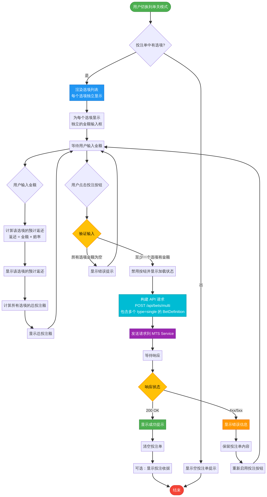

# MTS 前端交互逻辑设计 v2 (用户反馈优化版)

**版本**: 2.0  
**日期**: 2025-12-01  
**作者**: Manus AI

---

## 1. 概述

本文档根据用户的专业反馈进行了全面优化，旨在提供一套更贴近主流体育投注平台用户习惯的前端交互逻辑。新版设计以 **“单关” (Single)** 和 **“串关” (Multi)** 两种核心模式为基础，重构了投注单 (Bet Slip) 的交互流程，使其更具灵活性和专业性。

### 1.1. 核心设计变更：模式切换

与之前版本最大的不同在于，新版投注单的顶部应提供一个清晰、醒目的模式切换器（例如，Toggle Switch 或标签页），允许用户在 **“单关”** 和 **“串关”** 两种模式之间自由切换。这个选择将从根本上改变投注单的行为和最终的 API 请求结构，为专业用户提供更强大的投注灵活性。

**图 1：投注单核心交互流程图 (v2)**

如上图所示，用户的核心交互从选择模式开始，投注单根据所选模式（单关或串关）呈现完全不同的布局和功能。

---

## 2. 投注场景与交互逻辑 (v2)

### 2.1. 模式一：单关 (Single Mode)

在此模式下，所有投注都被视为独立的单注，即使用户在投注单中添加了多个选项。这为用户批量下注多个单关提供了极大的便利。

-   **触发条件**: 用户将投注单模式切换到 **“单关”**。
-   **前端交互**:
    1.  无论投注单中有多少个选项，每个选项都会被渲染为一个独立的投注单位，并配有**独立的金额输入框**。
    2.  用户可以为任意数量的选项输入投注金额。
    3.  界面会实时、独立地计算每个选项的预计返还金额，并在底部计算所有已输入金额的选项的总投注额。
    4.  用户点击“投注”按钮，一次性提交所有已输入金额的单注。
-   **API 调用**: `POST /api/bets/multi`
    -   请求体中的 `bets` 数组将包含多个 `BetDefinition` 对象。
    -   每个 `BetDefinition` 的 `type` 都将被设置为 `"single"`，并包含各自的 `selection` 和 `stake`。

**图 2：单关模式流程图**

### 2.2. 模式二：串关 (Multi Mode)

在此模式下，所有选项都被视为一个组合，可以进行串关、系统或 Banker 系统投注。这是构建复杂投注策略的核心功能区。

-   **触发条件**: 用户将投注单模式切换到 **“串关”**。
-   **前端交互**:
    1.  当用户切换到此模式，界面会聚合所有选项，并根据选项数量（至少2个）提供不同的组合投注方式。
    2.  **子场景将以标签页或折叠面板的形式清晰呈现**，包括：
        -   **串关 (Accumulator)**: 默认显示，将所有 N 个选项组合成一个 N 串 1 的投注。
        -   **系统 (System)**: 当选项 ≥ 3 个时可用，显示所有可能的系统组合（如二串一、三串一、Yankee 等）。
        -   **Banker**: 在“系统”视图内提供，允许用户将某些选项设为“胆”。

**图 3：串关模式（及子场景）流程图**

#### 2.2.1. 子场景：串关 (Accumulator)

-   **界面**: 显示一个总赔率（所有选项赔率的乘积）和一个**单一的总金额输入框**。
-   **API 调用**: `POST /api/bets/accumulator`

#### 2.2.2. 子场景：系统投注 (System Bet)

-   **界面**: 
    1.  列出所有可用的系统组合（例如，4 个选项会显示：二串一 (6 注)、三串一 (4 注)、Yankee (11 注)）。
    2.  用户可以为**每种组合**输入**单位投注金额**。
    3.  界面实时计算并显示总投注额。
-   **API 调用**: 
    -   自定义组合: `POST /api/bets/system`
    -   预设系统: `POST /api/bets/preset`

#### 2.2.3. 子场景：Banker 系统投注 (Banker System Bet)

-   **界面**: 
    1.  在系统投注的每个选项旁边，提供一个清晰的 **“B”** (Banker) 复选框。
    2.  当用户标记 Banker 后，系统组合列表会**动态更新**，只显示基于非 Banker 选项的组合。
    3.  用户为更新后的组合输入单位投注金额。
-   **API 调用**: `POST /api/bets/banker-system`

---

## 3. 结论

新版 v2 设计方案采纳了用户的专业建议，通过引入“单关/串关”模式切换，极大地提升了投注单的灵活性和专业性，使其更符合行业标准和资深用户的操作习惯。此设计不仅优化了用户体验，也清晰地映射了不同场景下的 API 调用逻辑，为前后端的高效协作奠定了坚实的基础。建议开发团队以此文档为最终指引进行开发。
