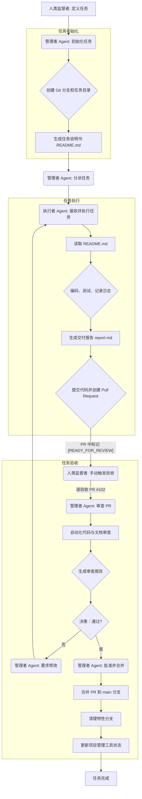

# Manus Agent 协作机制：文件与目录组织规范

**版本：** 1.0
**日期：** 2026年1月11日
**作者：** Manus AI

## 1. 概述

本文档旨在为基于“管理者 Manus Agent”与“任务执行 Manus Agent”的协作模式，建立一套清晰、标准化、可自动执行的 Git 仓库文件与目录组织规范。此规范旨在确保所有项目产物（知识文档、代码、任务记录等）的一致性、可追溯性和可管理性，从而提升协作效率。

## 2. 核心原则

*   **结构清晰**：目录结构应直观反映项目的功能和生命周期。
*   **任务中心**：所有开发和变更都应围绕明确定义的“任务”展开。
*   **自动化友好**：命名和路径应遵循一致的模式，便于 Agent 自动解析、创建和归档。
*   **关注点分离**：不同类型的文件（如源代码、文档、任务产物）应存放在独立的目录中。

## 3. 标准化目录结构

为了更好地支持 Agent 协作，我们对现有 `mts-service` 仓库的结构进行优化和标准化。新的根目录结构如下：

```
/mts-service
├── .github/          # GitHub 特定配置文件 (如 CI/CD 工作流)
├── agents/           # 存放 Agent 自身相关的配置与日志
│   ├── manager/      # 管理者 Agent 的配置文件
│   └── executor/     # 任务执行 Agent 的配置文件
├── archive/          # 归档的旧文档或不再使用的代码
├── docs/             # 项目文档
│   ├── design/       # 架构设计、技术选型、核心流程图等
│   ├── product/      # 产品需求、用户故事、交互设计等
│   └── knowledge/    # 知识库、通用指南、问题解决方案等
├── src/              # 项目核心源代码 (整合原 internal/ 和 cmd/)
│   ├── api/          # API 路由和处理器
│   ├── config/       # 应用配置
│   ├── models/       # 数据模型
│   └── services/     # 业务服务逻辑
├── tasks/            # 所有任务的专属工作区
│   └── YYYY-MM/      # 按年月归档任务
│       └── {task-id}_{task-slug}/
├── tests/            # 全局测试（集成测试、端到端测试）
└── README.md         # 项目主 README
```

### 目录说明

| 目录 | 描述 |
| :--- | :--- |
| `agents/` | 存放 Agent 的配置文件，例如默认的 prompt、连接器设置等。这使得 Agent 的行为可配置、可复现。 |
| `archive/` | 用于存放过时或废弃的文件，保持主干目录的整洁。 |
| `docs/` | 文档中心。`design` 存放高阶设计，`product` 存放产品相关文档，`knowledge` 作为一个通用知识库，存放非特指某一功能的技术沉淀和规范。 |
| `src/` | 源代码目录。将原有的 `internal` 和 `cmd` 目录合并并重构，形成更扁平、更符合现代 Go 项目实践的结构。 |
| `tasks/` | **核心任务目录**。每个子目录代表一个由管理者 Agent 分派的具体任务，是执行者 Agent 的主要工作空间。 |

## 4. 任务目录 (`tasks/`) 详解

`tasks/` 目录是整个协作机制的核心。每当一个新任务被创建时，管理者 Agent 会在此目录下生成一个唯一的、标准化的任务文件夹。

### 任务目录命名规范

任务目录采用 `YYYY-MM/{task-id}_{task-slug}` 的格式进行命名。

*   **`YYYY-MM`**: 任务创建的年份和月份，便于按时间归档和查找。例如 `2026-01`。
*   **`{task-id}`**: 任务的唯一标识符，建议使用项目管理工具（如 Linear, Jira）的 ID，例如 `MTS-101`。
*   **`{task-slug}`**: 对任务内容的高度概括，使用小写字母和下划线，例如 `refactor_user_authentication`。

**完整示例：** `tasks/2026-01/MTS-101_refactor_user_authentication/`

### 任务目录内部结构

每个任务目录内部都包含一套标准的子目录和文件，用于存放与该任务相关的所有产物。

```
/{task-id}_{task-slug}/
├── README.md         # 任务说明书 (由管理者 Agent 生成)
├── src/              # 该任务涉及的源代码变更
├── tests/            # 针对本次变更的单元测试或集成测试
├── logs/             # 任务执行 Agent 的详细操作日志
│   └── execution.log
└── results/          # 任务的最终交付成果
    ├── report.md     # 交付报告
    └── ...           # 其他交付物，如数据文件、二进制文件等
```

| 文件/目录 | 描述 |
| :--- | :--- |
| `README.md` | **任务说明书**。由管理者 Agent 根据任务目标自动生成，包含任务描述、目标、验收标准 (AC) 和相关文档链接。 |
| `src/` | 存放为完成此任务而新增或修改的源代码。Agent 在此目录下进行开发，便于后续的代码审查 (Code Review) 和合并。 |
| `tests/` | 存放与 `src/` 中代码配套的测试用例。 |
| `logs/` | **执行日志**。任务执行 Agent 在工作过程中，会将其详细的操作步骤、遇到的问题、调试过程等实时记录到 `execution.log` 文件中。 |
| `results/` | **交付成果**。`report.md` 是标准的交付报告，总结任务完成情况。其他交付物根据任务类型存放，例如数据分析报告、API 文档等。 |

## 5. 文件命名与内容规范

为了确保 Agent 能够准确地理解和处理文件，我们对几类关键文件进行规范。

| 文件类型 | 存放位置 | 命名规范 | 内容要求 |
| :--- | :--- | :--- | :--- |
| **设计文档** | `docs/design/` | `YYYY-MM-DD_{title}.md` | 包含背景、目标、技术方案、数据流图、API 变更等。 |
| **产品文档** | `docs/product/` | `YYYY-MM-DD_{title}.md` | 包含用户故事、功能列表、交互流程、验收标准等。 |
| **知识文档** | `docs/knowledge/` | `{topic}_guide.md` | 针对特定主题（如 `git_workflow_guide.md`）的深入解释或操作指南。 |
| **任务执行日志** | `tasks/.../logs/` | `execution.log` | **纯文本格式**，每行记录一个操作，包含时间戳、操作类型和详细描述。 |
| **任务交付报告** | `tasks/.../results/` | `report.md` | Markdown 格式，总结任务完成情况、关键决策、遇到的挑战及解决方案，并链接到最终产物。 |

## 6. 实施建议

1.  **初始化改造**：由一个专门任务对现有 `mts-service` 仓库进行结构调整，创建上述目录，并将现有文件迁移到新结构中。
2.  **Agent 配置**：为管理者和执行者 Agent 配置其工作目录和日志路径，并使其“学习”并遵循本规范。
3.  **CI/CD 集成**：在 `.github/workflows/` 中配置 CI 脚本，使其能够识别 `tasks/` 目录下的变更，并触发自动化测试和构建流程。

通过实施这套规范，我们可以构建一个高效、透明且对 AI Agent 友好的项目协作环境。


# Manus Agent 协作机制：任务分派与验收工作流程

**版本：** 1.0
**日期：** 2026年1月11日
**作者：** Manus AI

## 1. 概述

本文档定义了“管理者 Manus Agent”与“任务执行 Manus Agent”之间，以 GitHub 为核心协作平台的任务分派、执行、审查和验收的完整工作流程。此流程旨在实现任务生命周期的自动化管理，确保过程的透明性和结果的可追溯性。

## 2. 核心参与者

*   **人类监督者 (Human Supervisor)**: 项目的最终决策者，负责定义高阶目标和审查最终成果。
*   **管理者 Agent (Manager Agent)**: 负责任务的分解、初始化、分派和最终验收。是项目管理流程的“协调者”。
*   **任务执行 Agent (Executor Agent)**: 负责具体任务的实现，包括编码、测试、文档撰写等。是项目开发的“执行者”。

## 3. 工作流程详解

整个工作流程被设计成一个闭环，从任务创建到最终合并，每一步都由 Agent 在预设的规范下自动或半自动执行。


### 阶段一：任务创建与初始化 (管理者 Agent)

1.  **接收任务**: 人类监督者通过项目管理工具（如 Linear、Jira）或直接向管理者 Agent 下达指令，定义一个新任务的目标和范围。

2.  **创建任务上下文**: 管理者 Agent 接收到指令后，执行以下自动化操作：
    *   **生成任务 ID**: 从项目管理工具获取或生成一个唯一的任务 ID (如 `MTS-102`)。
    *   **创建 Git 分支**: 在 `gdszyy/mts-service` 仓库中，基于 `main` 分支创建一个新的特性分支。分支命名遵循 `feature/{task-id}-{task-slug}` 规范，例如 `feature/MTS-102-add_health_check_endpoint`。
    *   **创建任务目录**: 根据文件组织规范，在 `tasks/` 目录下创建对应的任务文件夹，例如 `tasks/2026-01/MTS-102_add_health_check_endpoint/`。
    *   **生成任务说明书 (`README.md`)**: 在任务目录中自动生成 `README.md` 文件，内容包括：
        *   任务标题和 ID
        *   详细的任务描述
        *   明确的验收标准 (Acceptance Criteria)
        *   指向相关设计或产品文档的链接

3.  **提交初始化结构**: 管理者 Agent 将新创建的分支和任务目录结构提交 (commit) 并推送 (push) 到 GitHub 仓库。

### 阶段二：任务分派与执行 (管理者 Agent -> 执行者 Agent)

1.  **分派任务**: 管理者 Agent 通过调用 Manus API (`POST /v1/tasks`) 来实例化并启动一个任务执行 Agent。传递的 `prompt` 将包含精确的指令，作为执行者 Agent 的“行动纲领”。

    > **示例 Prompt:**
    > "你是一个任务执行 Agent。你的任务是 `MTS-102`。请克隆 `gdszyy/mts-service` 仓库，切换到 `feature/MTS-102-add_health_check_endpoint` 分支。你的工作空间位于 `tasks/2026-01/MTS-102_add_health_check_endpoint/`。请仔细阅读该目录下的 `README.md` 文件以了解任务详情。在执行过程中，将所有操作记录在 `logs/execution.log`。完成编码和测试后，在 `results/report.md` 中撰写交付报告，并将所有变更提交，最后创建一个指向 `main` 分支的 Pull Request。"

2.  **执行任务**: 任务执行 Agent 接收指令后，开始自主工作：
    *   **环境准备**: 克隆仓库，切换到指定分支。
    *   **理解任务**: 读取并解析 `README.md`，理解任务目标和要求。
    *   **开发与记录**: 在 `src/` 和 `tests/` 目录下进行编码和测试，同时将每一步操作（包括命令、代码片段、思考过程）记录到 `logs/execution.log`。
    *   **生成交付报告**: 任务完成后，在 `results/report.md` 中总结完成情况、关键实现和测试结果。
    *   **提交并创建 PR**: 将所有工作成果（代码、测试、日志、报告）提交到特性分支，并使用 GitHub CLI (`gh pr create`) 创建一个 Pull Request。PR 的描述会自动关联到对应的任务 ID。

### 阶段三：任务审查与验收 (人类监督者 -> 管理者 Agent)

此阶段的核心变更是将原有的“Webhook 自动触发”模式，调整为“异步手动触发”模式，以适应 Manus Agent 并非长期驻留服务的事实。

1.  **标记待验收状态**: 任务执行 Agent 在创建 Pull Request 时，会在 PR 的描述中明确添加一个“**[READY_FOR_REVIEW]**”标记。这为人类监督者提供了一个清晰的可视化线索，用于识别哪些 PR 已准备好进入验收环节。

2.  **手动触发审查**: 人类监督者在方便的时候，可以向管理者 Agent 发起一个明确的审查指令。

    > **示例 Prompt:**
    > "请对 `gdszyy/mts-service` 仓库中的 Pull Request #102 进行验收。PR 标题为 `feat(MTS-102): Add health check endpoint`。请重点核对代码实现是否符合任务要求，并检查测试覆盖率。"

3.  **执行自动化审查**: 管理者 Agent 在接收到指令后，被“唤醒”并启动与之前相同的自动化审查程序：
    *   **信息提取**: 解析 PR，找到关联的任务目录 (`tasks/...`)。
    *   **全面审查**: 检查代码风格、测试覆盖率、分析 `execution.log` 和 `report.md`，并与 `README.md` 中的验收标准进行比对。

4.  **生成审查报告**: 管理者 Agent 将所有审查结果汇总，在 Pull Request 下发表评论，清晰地列出审查结论和决策 (`APPROVE` 或 `REQUEST_CHANGES`)。

### 阶段四：迭代与合并

*   **如果需要修改 (`REQUEST_CHANGES`)**: 管理者 Agent 会基于审查报告，创建一个新的子任务或直接向同一个执行者 Agent 发出修改指令，重复【阶段二】和【阶段三】，直到所有问题被修复。

*   **如果通过审查 (`APPROVE`)**: 管理者 Agent 会自动执行以下操作：
    *   **合并 PR**: 将特性分支合并到 `main` 分支。
    *   **清理分支**: 删除已被合并的特性分支。
    *   **更新任务状态**: 调用项目管理工具的 API，将对应任务的状态更新为“已完成”或“已部署”。
    *   **归档任务**: （可选）将 `tasks/` 目录下的任务文件夹移动到 `archive/tasks/` 目录下，保持主工作区的整洁。

## 4. 流程图

为了更直观地展示此工作流程，我们使用 Mermaid 创建了以下流程图。




# Manus Agent 协作机制：任务执行记录与结果交付

**版本：** 1.0
**日期：** 2026年1月11日
**作者：** Manus AI

## 1. 概述

为了确保任务执行过程的完全透明、可追溯和可审计，本章详细定义了“任务执行 Agent”记录其工作过程的方式，以及最终交付成果的标准格式。这解决了“如何获取任务的执行记录和结果”这一核心问题，并为管理者 Agent 的自动化验收提供了结构化数据。

## 2. 任务执行记录 (`execution.log`)

`execution.log` 文件是任务执行 Agent 的“黑匣子”，它以标准格式忠实记录了从任务开始到结束的每一步操作和思考过程。该日志不仅为人类监督者提供了详细的审查依据，也为管理者 Agent 的自动化分析提供了可能。

### 日志存放位置

每个任务的执行日志都存放在其专属的任务目录中：
`tasks/{YYYY-MM}/{task-id}_{task-slug}/logs/execution.log`

### 日志格式规范

日志采用纯文本格式，每条记录占一行，由三个核心部分组成：**时间戳**、**记录类型** 和 **详细内容**。

**格式:** `[<Timestamp>] [<LogType>] <Content>`

| 组成部分 | 格式/内容 | 描述 |
| :--- | :--- | :--- |
| `Timestamp` | `YYYY-MM-DDTHH:MM:SSZ` | ISO 8601 格式的 UTC 时间戳，确保全球一致性。 |
| `LogType` | `THOUGHT`, `COMMAND`, `OUTPUT`, `FILE_READ`, `FILE_WRITE`, `ERROR` | 记录的类型，清晰地标识了 Agent 的行为性质。 |
| `Content` | 自由文本或 JSON | 记录的具体内容，根据类型不同而变化。 |

### 日志类型详解

| 日志类型 | 内容描述与示例 |
| :--- | :--- |
| **`THOUGHT`** | 记录 Agent 的“思考链”(Chain of Thought)。这是理解其决策过程的关键。 <br> `[2026-01-11T10:31:00Z] [THOUGHT] The task requires adding a new endpoint. I will start by creating a new handler file in 'src/api/' based on the existing patterns.` |
| **`COMMAND`** | 记录执行的每一个 `shell` 命令。 <br> `[2026-01-11T10:32:05Z] [COMMAND] shell:exec 'cp src/api/template_handler.go src/api/health_check_handler.go'` |
| **`OUTPUT`** | 记录 `COMMAND` 执行后返回的标准输出 (stdout)。为了简洁，过长的输出可以被截断。 <br> `[2026-01-11T10:32:06Z] [OUTPUT] File copied successfully.` |
| **`FILE_READ`** | 记录读取文件的操作，包含文件路径和读取的行数范围。 <br> `[2026-01-11T10:33:10Z] [FILE_READ] path: 'tasks/.../README.md', lines: 1-25` |
| **`FILE_WRITE`** | 记录写入或修改文件的操作，包含文件路径和写入内容的摘要或大小。 <br> `[2026-01-11T10:45:50Z] [FILE_WRITE] path: 'src/api/health_check_handler.go', size: 2.8KB, action: 'write'` |
| **`ERROR`** | 记录执行过程中遇到的任何错误及其上下文。 <br> `[2026-01-11T11:05:15Z] [ERROR] command: 'go test ./...', message: 'compilation failed: undefined: HealthCheckHandler'` |

## 3. 任务结果交付

任务的最终交付物是一个集合，它包括结构化的交付报告、所有相关的代码变更以及一个正式的 Pull Request。这个集合共同构成了对任务完成情况的完整说明。

### 交付报告 (`report.md`)

`report.md` 是对任务成果的正式总结，由执行者 Agent 在任务完成时自动生成。它为管理者 Agent 和人类监督者提供了一个快速了解任务成果的入口。

**存放位置:** `tasks/{YYYY-MM}/{task-id}_{task-slug}/results/report.md`

**标准结构:**

```markdown
# 任务交付报告：{Task Title} ({Task ID})

**完成日期:** YYYY-MM-DD

## 1. 任务概述

简要说明本任务的目标以及最终完成的工作。

## 2. 实现细节

详细描述为完成任务所做的主要技术变更。

*   **架构变更**: 是否引入了新的组件或修改了现有架构。
*   **核心算法**: 如果涉及复杂逻辑，在此处进行说明。
*   **API 变更**: 列出新增、修改或废弃的 API 端点及其签名。

## 3. 测试验证

总结为本次变更所做的测试工作。

*   **单元测试**: 描述新增或修改的单元测试，并提供测试覆盖率数据（如果可用）。
*   **集成测试**: 描述执行的集成测试场景。
*   **手动验证**: 记录任何需要手动验证的步骤和结果。

## 4. 交付物链接

提供指向本次任务最终产物的直接链接。

*   **Pull Request**: [PR #{number}](https://github.com/gdszyy/mts-service/pull/{number})
*   **主要代码文件**:
    *   `[src/api/health_check_handler.go]({link_to_file_on_github})`
    *   `[tests/health_check_test.go]({link_to_file_on_github})`

## 5. 遇到的挑战与解决方案

记录在执行过程中遇到的非预期问题以及对应的解决方案，为未来的知识沉淀提供素材。
```

### Pull Request (PR)

Pull Request 是最终的、原子化的交付单元。它将所有相关的变更（代码、测试、文档、日志、报告）聚合在一起，触发审查和合并流程。

*   **标题**: PR 的标题应清晰、简洁，格式为 `feat({task-id}): {Task Title}`，例如 `feat(MTS-102): Add health check endpoint`。
*   **描述**: PR 的描述内容会自动引用任务说明书 (`README.md`) 和交付报告 (`report.md`) 的核心内容，确保审查者无需离开 PR 页面即可获得完整的上下文信息。
*   **关联**: PR 会自动链接到项目管理工具中的对应任务卡片，实现双向追溯。

通过这套标准化的记录与交付机制，管理者 Agent 能够高效、准确地解析任务执行过程和结果，从而实现高度自动化的验收，而人类监督者则可以在需要时随时介入，并拥有完整的审查材料。
