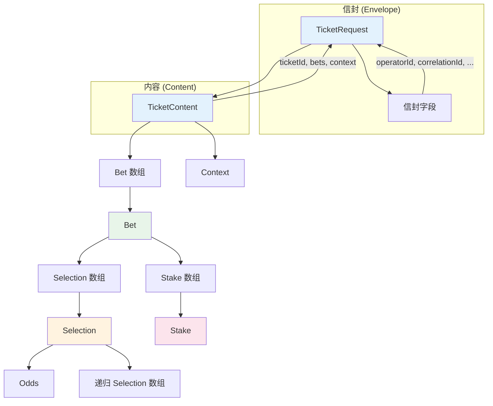

# MTS 注单结构化文档体系

**版本**: 1.0  
**日期**: 2025年11月27日  
**作者**: Manus AI

---

## 1. 概述

本文档体系旨在提供一份关于 **Sportradar MTS Transaction 3.0 API** 注单结构的全面、细致且结构化的参考指南。它将注单 (`TicketRequest`) 分解为多个核心对象，并为每个对象创建了详细的子文档，深入到每个字段的业务意义、数据类型、约束和示例。

这种分层、链接的文档结构旨在帮助开发人员快速理解和正确实现 MTS 注单的构建和解析，减少集成过程中的错误。

## 2. 注单顶层结构

一个完整的 MTS 注单请求 (`TicketRequest`) 由两部分组成：**信封 (Envelope)** 和 **内容 (Content)**。

- **信封 (Envelope)**: 包含元数据，如操作员 ID、时间戳和操作类型，为内容提供上下文。
- **内容 (Content)**: 包含实际的投注信息，如注单 ID、投注详情和用户上下文。

```json
{
  "operatorId": 45426,
  "correlationId": "init-1764059527727914658",
  "timestampUtc": 1764059527727,
  "operation": "ticket-placement",
  "version": "3.0",
  "content": {
    "type": "ticket",
    "ticketId": "init-ticket-1764059527727917670",
    "bets": [
      // ... Bet 对象数组
    ],
    "context": {
      // ... Context 对象
    }
  }
}
```

## 3. 核心对象索引

以下是构成一个 MTS 注单的核心对象。点击链接查看每个对象的详细字段说明。

| 对象 (Object) | 描述 | 子文档链接 |
|:---|:---|:---|
| `TicketRequest` | 注单请求的顶层结构，包含信封和内容。 | [TicketRequest.md](./TicketRequest.md) |
| `TicketContent` | 注单的核心内容，包含注单 ID 和投注数组。 | [TicketContent.md](./TicketContent.md) |
| `Bet` | 单个投注单元，包含选项和金额。 | [Bet.md](./Bet.md) |
| `Selection` | **最核心的对象**，代表一个投注选项，支持多种类型。 | [Selection.md](./Selection.md) |
| `Stake` | **核心对象**，定义了投注的金额、货币和模式。 | [Stake.md](./Stake.md) |
| `Odds` | 赔率对象，定义了赔率的类型和值。 | [Odds.md](./Odds.md) |
| `Context` | 可选的上下文信息，如渠道、IP 地址等。 | [Context.md](./Context.md) |

## 4. 结构关系图



## 5. 使用指南

1.  **从主文档开始**: 首先阅读本主文档，了解整体结构。
2.  **深入核心对象**: 根据您的需求，点击索引中的链接，深入了解 `Selection` 和 `Stake` 等核心对象的详细信息。
3.  **参考示例**: 每个子文档都包含详细的 JSON 示例，展示了不同配置下的字段构成。
4.  **结合代码**: 将文档与 `mts-service` 项目中的 `internal/models` 包下的 Go 结构体进行对比，以加深理解。

这套文档将作为您在开发过程中最可靠的参考。
