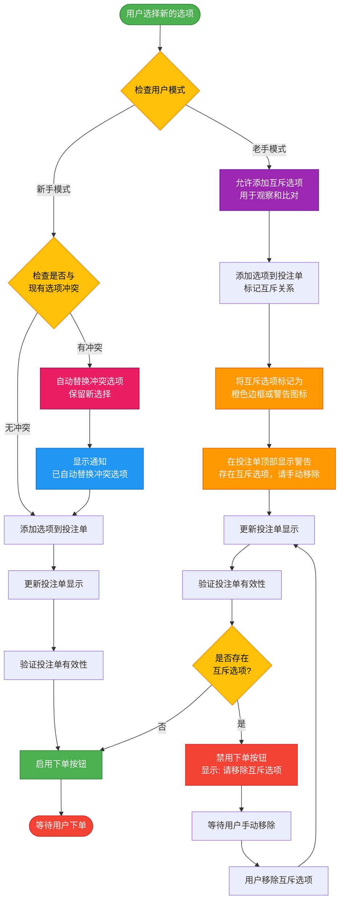
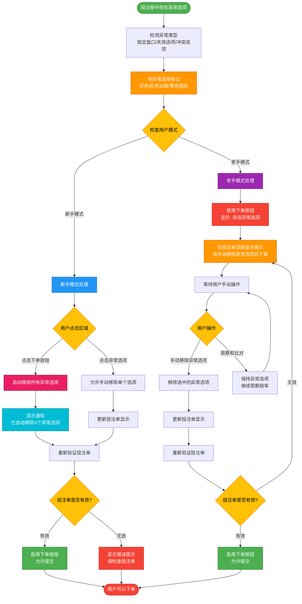
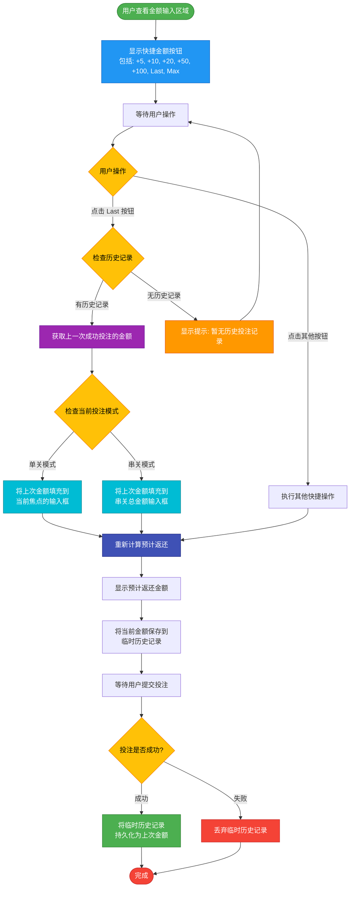

# MTS 前端交互逻辑设计 v4 (专家模式增强版)

**版本**: 4.0  
**日期**: 2025-12-01  
**作者**: Manus AI

---

## 1. 概述

本文档是 MTS 前端交互逻辑的第四次迭代，在 v3 的精细化设计基础上，采纳了更深层次的用户行为洞察，引入了 **“新手/老手模式”** 的概念。这一核心增强旨在为不同经验水平的用户提供截然不同的、但都同样流畅的投注体验，从而实现真正的个性化服务。v4 版本专注于解决 **互斥选项处理** 和 **异常选项清理** 这两大场景下新手与老手用户的核心诉求差异。

---

## 2. 核心交互逻辑 (继承 v3)

核心交互依然遵循 v3 版本的设计，包括：

-   **“单关/串关”双模式切换**
-   **模式切换时的“清空并确认”策略**
-   **可配置的快捷金额选项**
-   **全面的设置页面**
-   **精细化的异常情况处理**

---

## 3. 专家级功能增强 (v4 新增)

### 3.1. 新手/老手模式 (User Mode)

这是 v4 版本的核心。在“设置页面”中，我们新增一个 **“用户模式”** 选项，允许用户在“新手模式”和“老手模式”之间选择。此设置将从根本上改变系统处理互斥选项和异常选项的方式。

| 模式 | 目标用户 | 核心特点 |
| :--- | :--- | :--- |
| **新手模式 (默认)** | 新用户、休闲玩家 | **便捷、防错**：自动处理冲突，简化决策流程。 |
| **老手模式** | 专业玩家、高频用户 | **灵活、可控**：允许用户观察和手动处理复杂情况。 |

### 3.2. 互斥选项处理

当用户在同一场比赛中选择了互斥的选项时（例如，同时选择主队胜和平局），系统将根据用户模式采取不同策略。

**图 1：互斥选项处理流程图**

-   **新手模式**：
    -   **自动替换**：当用户选择一个与已有选项互斥的新选项时，系统会自动用新选项替换旧选项。
    -   **用户提示**：同时，界面会显示一个简短的通知（例如，“已自动替换冲突选项”），让用户了解发生了什么。

-   **老手模式**：
    -   **允许多选**：系统允许用户将互斥选项同时保留在投注单中。
    -   **视觉警告**：所有互斥的选项都会被高亮标记（例如，橙色边框或警告图标），并在投注单顶部显示警告信息：“存在互斥选项，无法投注。”
    -   **下单禁用**：只要投注单中存在互斥选项，“下单”按钮就会被禁用，强制要求用户手动移除冲突项后才能继续。

### 3.3. 智能异常选项处理

当投注单中出现锁定的盘口、失效的选项或互斥的串关时，系统将根据用户模式提供不同的清理机制。

**图 2：智能异常选项处理流程图**

-   **新手模式**：
    -   **一键清理**：当投注单中存在异常选项时，“下单”按钮会变为 **“移除异常并下单”**。
    -   **用户操作**：用户点击该按钮后，系统会自动移除所有异常选项，并提交剩余的有效投注。
    -   **用户提示**：同时，界面会显示通知：“已自动移除 X 个异常选项并提交投注。”

-   **老手模式**：
    -   **手动清理**：系统会高亮所有异常选项，但不会提供自动清理功能。
    -   **下单禁用**：“下单”按钮会被禁用，并显示提示：“请手动移除所有异常选项。”
    -   **用户操作**：老手用户可以从容地观察、比对这些异常选项，然后根据自己的判断手动移除它们，直到投注单变为有效状态。

### 3.4. “使用上次金额”功能

为了进一步提升高频用户的投注效率，我们在快捷金额选项中新增了 **“Last” (上次)** 按钮。

**图 3：“使用上次金额”功能流程图**

-   **功能**：点击“Last”按钮，系统会自动将上一次**成功提交**的投注金额填充到当前输入框中。
-   **逻辑**：
    -   系统只记录**成功**的投注金额。
    -   在“单关模式”下，会将金额填充到当前有焦点的输入框。
    -   在“串关模式”下，会将金额填充到总金额或单位金额输入框。
    -   如果无历史记录，则提示用户“暂无历史投注记录”。

---

## 4. 结论

v4 版本通过引入“新手/老手模式”，成功地在“便捷性”和“灵活性”之间找到了完美的平衡点。它不仅为新手用户提供了无缝、防错的投注路径，也为专业玩家提供了他们所需要的强大控制力和观察能力。这些专家级的功能增强，将使 MTS 前端在市场竞争中脱颖而出，能够同时满足更广泛用户群体的需求。我们强烈建议开发团队以此 v4 文档作为最终的开发蓝图。
