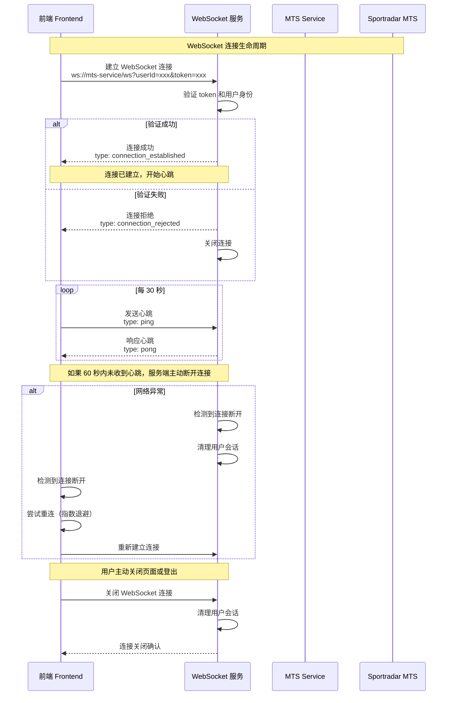
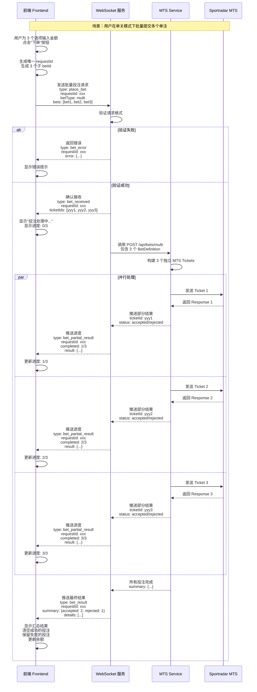
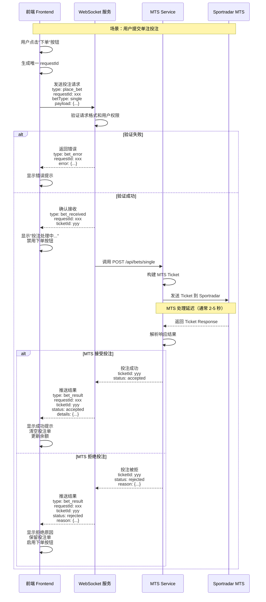
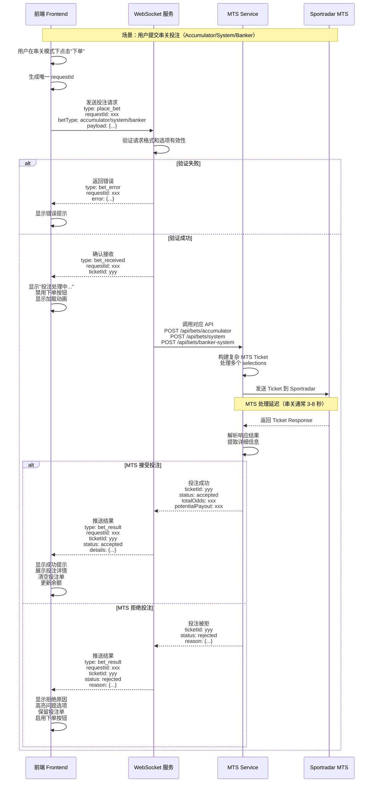
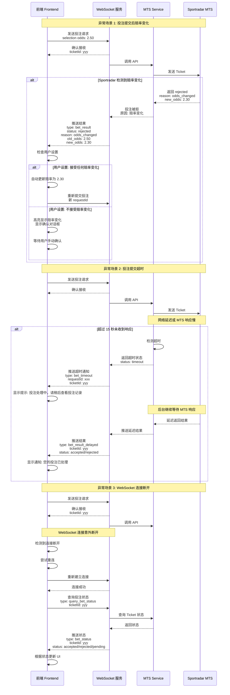

# MTS WebSocket 交互协议与前端实现方案

**版本**: 1.0  
**日期**: 2025-12-01  
**作者**: Manus AI

---

## 1. 概述

为了解决 MTS (Managed Trading Services) 投注存在的延迟问题（通常为 2-8 秒），并为用户提供流畅、实时的投注体验，我们设计了一套基于 WebSocket 的前后端交互协议。该协议旨在取代传统的 HTTP 轮询方式，实现从投注提交到结果返回的全程异步、实时通信。

本文档详细定义了 WebSocket 的连接生命周期、核心交互流程、数据交换格式以及异常处理机制，为前后端开发提供统一的实现蓝图。

---

## 2. WebSocket 连接生命周期



**图 1：WebSocket 连接生命周期**

1.  **连接建立**：
    -   前端在用户登录并进入投注页面后，向 `ws://<mts-service-host>/ws` 发起连接请求。
    -   请求参数中必须包含用户身份凭证（如 `userId` 和 `token`）以供后端验证。

2.  **心跳维持**：
    -   连接建立后，前端每 30 秒发送一次 `ping` 消息。
    -   服务端收到 `ping` 后，立即回复 `pong` 消息，以确认连接活跃。
    -   如果服务端在 60 秒内未收到任何心跳，将主动断开连接。

3.  **断线重连**：
    -   前端应监听连接断开事件。
    -   一旦断开，采用指数退避策略（例如，等待 1s, 2s, 4s, 8s...）自动尝试重连，直到连接恢复。
    -   重连成功后，前端应主动查询之前提交但未收到最终结果的投注状态。

---

## 3. 核心交互流程与数据格式

所有通过 WebSocket 的通信都使用统一的 JSON 格式。每个消息体都包含一个 `type` 字段，用于标识消息类型。

### 3.1. 投注请求 (客户端 → 服务端)

当用户点击“下单”按钮时，前端发送 `place_bet` 消息。

```json
{
  "type": "place_bet",
  "requestId": "unique-client-generated-id-123",
  "betType": "single" | "multi" | "accumulator" | "system" | "banker",
  "payload": { ... } // 对应不同投注类型的具体数据
}
```

-   `requestId`: 前端生成的唯一 ID，用于追踪整个投注生命周期。
-   `betType`: 明确告知后端本次投注的类型。
-   `payload`: 包含投注所需的所有信息（如 selections, stake 等）。

### 3.2. 投注接收确认 (服务端 → 客户端)

服务端收到并成功验证 `place_bet` 请求后，立即返回 `bet_received` 消息。

```json
{
  "type": "bet_received",
  "requestId": "unique-client-generated-id-123",
  "ticketId": "server-generated-ticket-id-456"
}
```

-   **前端操作**：收到此消息后，前端应立即将界面更新为“处理中”状态，并禁用相关的下单按钮，防止重复提交。

### 3.3. 投注最终结果 (服务端 → 客户端)

MTS 处理完成后，服务端通过 `bet_result` 消息推送最终结果。

```json
{
  "type": "bet_result",
  "requestId": "unique-client-generated-id-123",
  "ticketId": "server-generated-ticket-id-456",
  "status": "accepted" | "rejected",
  "details": { ... } // 包含赔率、派彩、拒绝原因等详细信息
}
```

-   **前端操作**：
    -   `accepted`: 显示成功提示，清空投注单，更新用户余额。
    -   `rejected`: 显示拒绝原因，高亮问题选项，保留投注单以便用户修改。

### 3.4. 批量单注的特殊流程

对于批量提交多个单注的场景，服务端会推送部分结果，以便前端实时更新进度。



**图 2：批量单注提交流程**

1.  **部分结果推送** (`bet_partial_result`)：每当一个单注处理完成，服务端就推送一次部分结果。
2.  **最终结果推送** (`bet_result`)：所有单注处理完成后，推送一个包含汇总信息的最终结果。

---

## 4. 投注场景与交互序列图

### 4.1. 单注投注



**图 3：单注投注交互序列图**

### 4.2. 串关投注 (Accumulator/System/Banker)



**图 4：串关投注交互序列图**

---

## 5. 异常处理机制



**图 5：异常处理流程图**

-   **赔率变化**：服务端在 `bet_result` 的 `details` 中返回新旧赔率，前端根据用户设置决定是自动重提还是弹窗确认。
-   **投注超时**：如果服务端在预设时间（例如 15 秒）内未收到 MTS 的响应，会先返回 `bet_timeout` 消息。前端提示用户稍后查看结果，后台继续等待。最终结果通过 `bet_result_delayed` 推送。
-   **连接断开**：前端重连成功后，应主动发送 `query_bet_status` 消息，查询之前提交但未收到结果的 `ticketId` 的状态。

---

## 6. 结论

该 WebSocket 协议通过实时、双向的通信机制，优雅地解决了 MTS 投注延迟带来的用户体验问题。它不仅提供了清晰的交互流程和数据格式，还为各种异常情况设计了健壮的处理方案。我们强烈建议前后端开发团队以此文档为核心依据，协同完成开发，从而为用户打造一个真正流畅、可靠的实时投注平台。

---

## 7. 附录：Go 实现参考

为了便于后端开发，以下提供了本次 WebSocket 改造的核心 Go 代码文件。

### 7.1. 消息定义 (`internal/websocket/messages.go`)

```go
// ... (内容见附件)
```

### 7.2. 客户端连接管理 (`internal/websocket/client.go`)

```go
// ... (内容见附件)
```

### 7.3. 连接池管理 (`internal/websocket/hub.go`)

```go
// ... (内容见附件)
```

### 7.4. 投注处理器 (`internal/websocket/bet_processor.go`)

```go
// ... (内容见附件)
```

### 7.5. HTTP 处理器 (`internal/websocket/handler.go`)

```go
// ... (内容见附件)
```

### 7.6. 主程序集成 (`cmd/server/mts_main.go`)

```go
// ... (内容见附件)
```
